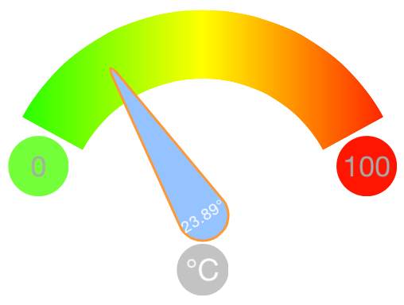

DTGaugeView
===========
DTGaugeView started as a fork and is inspired by [Thomas Winklers](https://github.com/tomgong) - 
[SFGaugeView](https://github.com/simpliflow/SFGaugeView). A custom UIView with a gauge 
control (tachometer like control). Changes of the needle are animated.

Colors, sizes, visibility and opacity can be customized. You can use the IBs 
__Attributes Inspector__ (see screenshot below) to change all properties and just need to 
adjust the currentNeedleLevel to have your value displayed.




Setup
-----

**Installing with [CocoaPods](http://cocoapods.org)**

If you're unfamiliar with CocoaPods you can check out this tutorial 
[here](http://www.raywenderlich.com/12139/introduction-to-cocoapods).

1. In Terminal navigate to the root of your project.
2. Run 'touch Podfile' to create the Podfile.
3. Open the Podfile using 'open -e Podfile'
4. Add the pod `DTGaugeView` to your [Podfile](https://github.com/CocoaPods/CocoaPods/wiki/A-Podfile).

        platform :ios, '8.0'
        use_frameworks! # update cocoapods if needed "[sudo] gem install cocoapods"
        pod 'DTGaugeView', '~> 0.1.0'
        
5. Run `pod install`.
6. Open your app's `.xcworkspace` file to launch Xcode and start using the control!

Usage
-----

1. Either create DTGaugeView by dragging UIView from storyboard and change implementing 
class or create it programmatically (see Screenshot below for storyboard configuration)
2. Create an outlet (if create via storyboard)
3. Set up parameters like below
4. GaugeControl interaction __currentNeedleLevel__ --> sets the current level of the needle

```objective-c
	DTGaugeView *gauge;
	gauge = [[DTGaugeView alloc] initWithFrame:CGRectMake(20, 275, 170, 200)];
	// use arcBackgroundColor or set an NSArray of UIColors to add a gradient
	gauge.arcBackgroundColor = [UIColor redColor];
	// if arcGradientColors are set the arcBackgroundColor can't be seen
	gauge.arcGradientColors = [NSArray arrayWithObjects:
                                        (id)[UIColor grayColor].CGColor,
                                        (id)[UIColor yellowColor].CGColor,
                                        (id)[UIColor blueColor].CGColor,
                                        (id)[UIColor blackColor].CGColor,
                                        nil];
	gauge.needleColor = [UIColor colorWithRed:27/255.0 green:103/255.0 blue:107/255.0 alpha:1];
	gauge.minlevel = 0;
	gauge.maxlevel = 100;
	gauge.currentNeedleLevel = 60;
	gauge.isGivenInDegrees = YES;
	[self.view addSubview:gauge];
```

These properties can all be set:
```objective-c
		// Min/Max labels
        CGFloat             maxlevel;					// level for right side of arc and MaxLabels text
		CGFloat             minlevel;					// level for left side of arc and MinLabels text
		BOOL                hideMinMaxLabels;			// if set to YES the MinMaxLabels are hidden
		CGFloat             minMaxTextSize;				// text size of both MinMaxLabels
		UIColor             *minimumTextColor;			// text color of minimum label
		UIColor             *maximumTextColor;			// text color of maximum label
		BOOL                showMinMaxLabelsAsCircle;	// if set to YES both MinMaxLabels are drawn as circle
		UIColor             *minBackgroundColor;		// background color of minimum label
		UIColor             *maxBackgroundColor;		// background color of maximum label
		CGFloat             minMaxLabelAlpha;			// opacity/alpha of both MinMaxLabels

		// Needle label
		CGFloat             needleTextSize;				// text size of needles value label
		UIColor             *needleTextColor;			// text color of needles value label

		// Needle
		CGFloat             needleWidth;				// width of needles source/circle
		UIColor             *needleColor;				// color of needle
		UIColor             *needleStrokeColor;			// color of needle border
		CGFloat             currentNeedleLevel;			// sets the current Level
		CGFloat             needleOpacity;

		// Unit label
		NSString            *unit;						// string for unit label
		BOOL                hideUnitLabel;				// if set to YES the unit label is hidden
		UIColor             *unitTextColor;				// text color of unit label below needle
		UIColor             *unitBackgroundColor;		// background color of unit label below needle
		CGFloat             unitTextSize;				// text size of unit label below needle
		BOOL                showUnitLabelAsCircle;		// if set to YES unit label is drawn as circle

		// Arc
		UIColor             *arcBackgroundColor;		// background color of arc on top
		NSArray             *arcGradientColors;			// NSArray of UIColor for the gradient of the arc
		CGFloat             arcWidth;					// width of arc

		// Border of needle view just for help
		CGFloat             needleViewBorderWidth;		// border width of needle view to see where it is drawn
		UIColor             *needleViewBorderColor;		// border color of needle view

		// etc
		BOOL                isGivenInDegrees;			// if set to YES "°" is added to text in needle
```


        

Licence
-------

Distributed under the MIT License.
